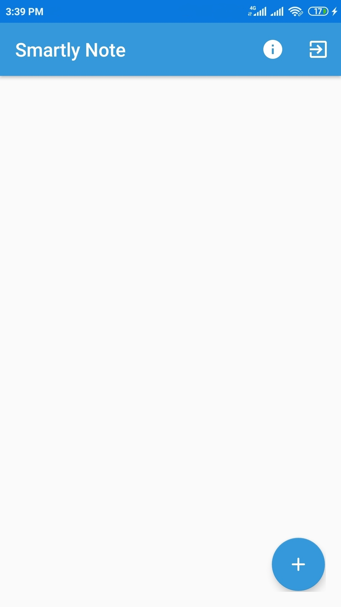

# Welcome to Smartly Note
___
### A Note Taking App designed for you completely free.
Smartly Note app helps you take notes on the go. You can access it from any device at anytime anywhere. You can also keep images of your study notes topic-wise. If you are a professional, you can store your meeting audio notes safely. All your notes get  synchronized  automatically in background, so no worry.

### Features
* Create new notes every-time with worrying storage.
* Quick access notes, anywhere, anytime.
* Capture images of your study notes
* Store your meeting audio notes safely.
* Note Smartly will remind you all your important tasks.
* Get your notes well organized.
* All your data backup is kept every-time you create new task.
* Delete all your private notes later.
* Minimalist design and app icons.
* Safe, Fast and Easy. 

### Screenshots
 | 
--------------------------------------------|----------------------------------------
Easy login provided through Google account. | Beautifully organized, easy to manage your notes.

 | 
--------------------------------------------|----------------------------------------
Add title and detailed description as per your convenience. | Information about creator and bug report feature.

### Credits
A special thanks to my friend @ghanshyam09 for being helping hand in places where I stuck.

### Contribution
The project is open for contribution. Any valid and valuable submission will be examined.
Please do report if an bugs encountered.

### More Info
For further more information or updates visit [our website](https://www.sites.google.com/view/smartlynote)
Download my app from [Amazon App Store](#)
 Write us at smartlynote@gmail.com